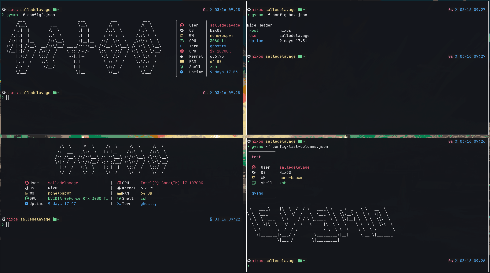
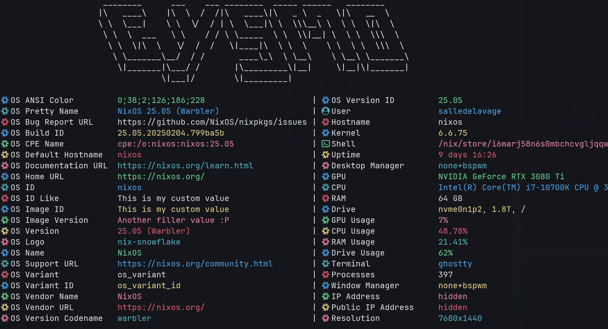
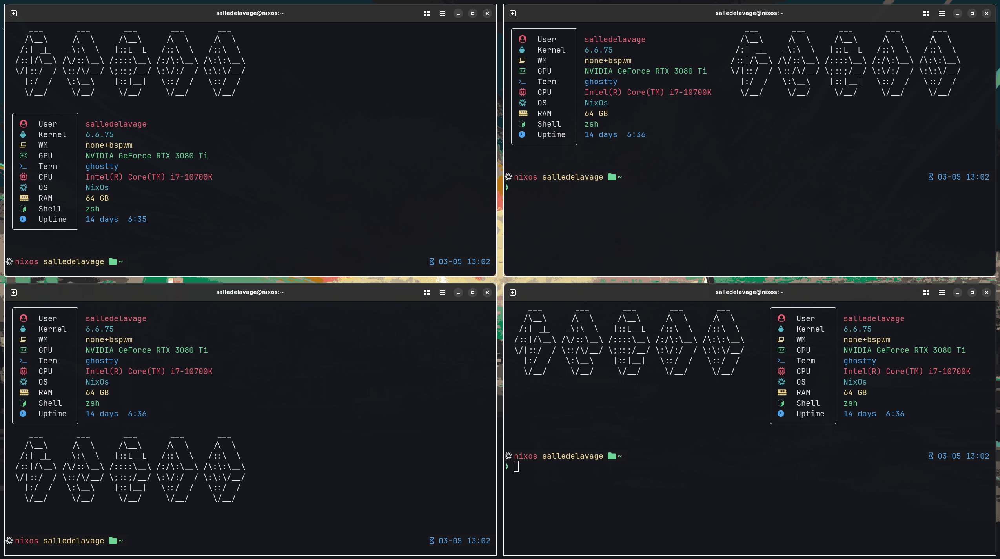
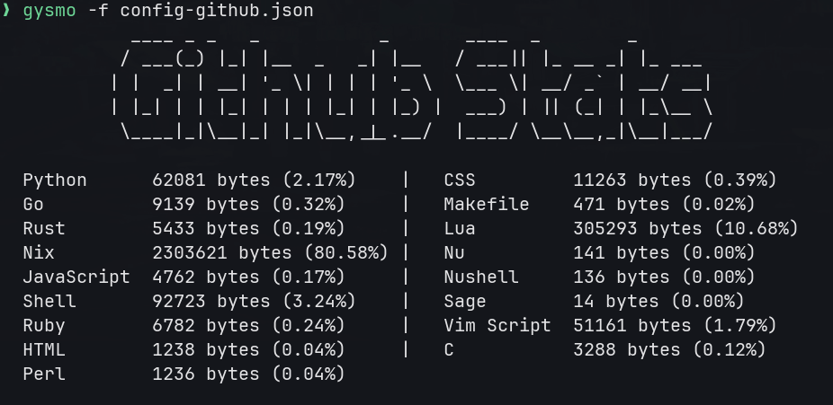
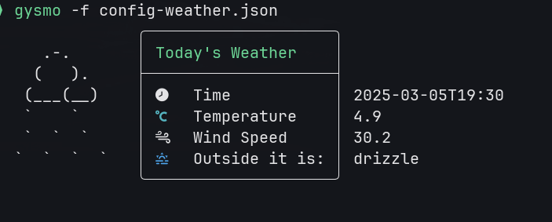
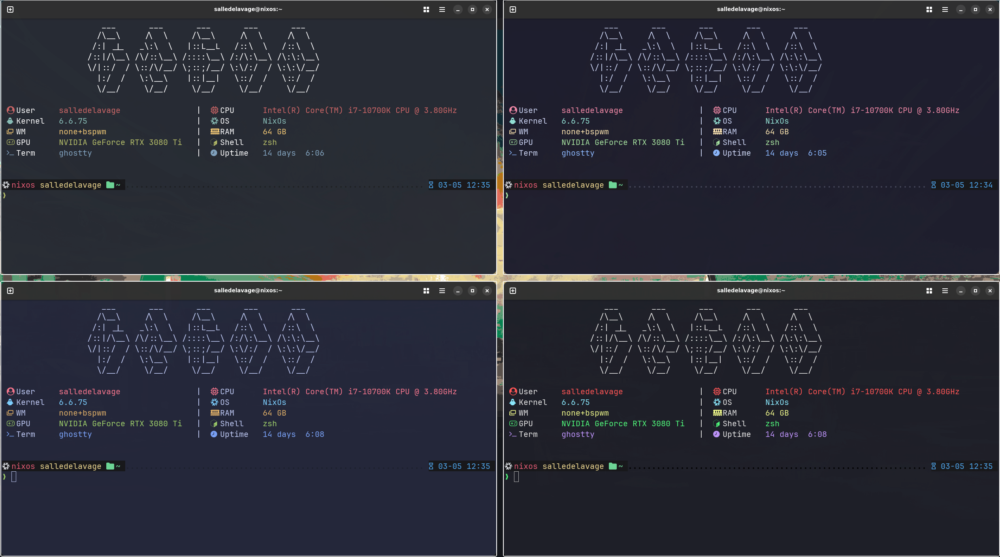
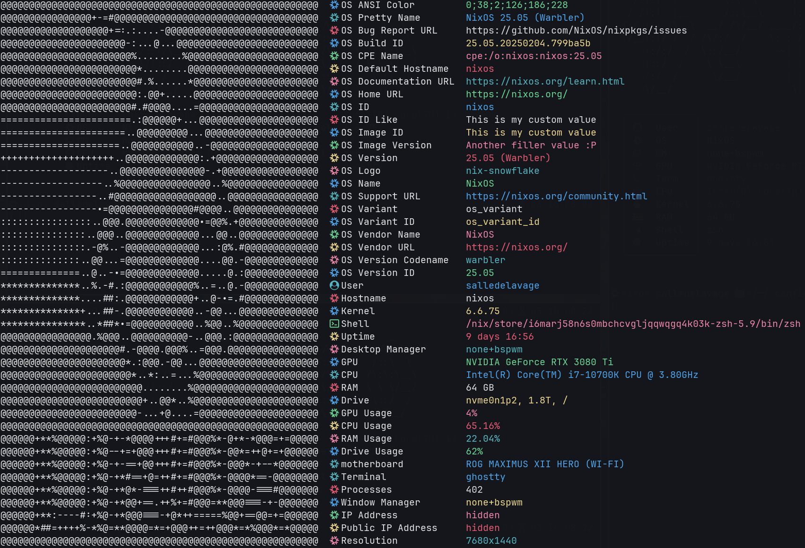
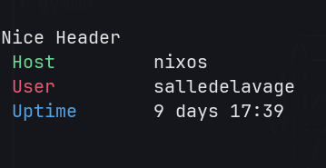

# gysmo 📟


[](https://github.com/grosheth/gysmo/releases/tag/v0.2.0)
[](https://www.codefactor.io/repository/github/grosheth/gysmo/overview/main)


**gysmo** is a fun and visually engaging CLI tool written in Go, designed to enhance your terminal experience. While it does provide system information, its primary purpose is to showcase your stylish terminal setup.

**Key Features:**
- **Highly Customizable:** Tailor gysmo to your preferences with user-configurable settings. The default JSON configuration is cool, but we encourage you to make it your own.
- **Show Off Your Setup:** Perfect for proudly displaying that you use Arch, by the way.
- **Inspired by the Best:** Draws inspiration from [nitch](https://github.com/ssleert/nitch) and [neofetch](https://github.com/dylanaraps/neofetch).

**DISCLAIMER:**
gysmo is not intended to be an accurate system information tool. There are many other tools available for that purpose.

## 📥 Installation

### Use the installation script (RECOMMENDED)
Recommended for most Linux Distros.

The installation/update script does the following
1. Download the binary
2. Create the directory structure ~/.config/gysmo/... and ~/.local/bin
3. Copy the template config.json file if it doesn't exist (don't want to overwrite your config in an update)
4. Copy the schema validator file
5. Copy a sample ASCII art if it doesn't exist

```shell
wget https://raw.githubusercontent.com/grosheth/gysmo/main/installation.sh && sh installation.sh && rm installation.sh
```

### Home-manager (Package is in Nixpkgs)
You can add this to your home-manager configuration to install gysmo..

```nix
{ pkgs, ... }:
{
  programs.gysmo = {
    enable = true;
  };
}
```

### Nixpkgs (Home-manager is the supported way to install)
⚠️ **WARNING**: when installing directly from nixpkgs without home-manager run the following to make sure everything is correctly installed.

```shell
wget https://raw.githubusercontent.com/grosheth/gysmo/main/nix_installation.sh && sh nix_installation.sh && rm nix_installation.sh
```

### Build From Source
`
You will need to have Go installed for this.
`
If you are a true Linux user and you won't submit to anyone else automated processes (as is your right), you can always prove your superiority by building the project from source.
This also allows you to understand how the project works a little better.

```shell
git clone https://github.com/grosheth/gysmo.git
cd gysmo/src

go build -o gysmo

mkdir ~/.config/gysmo
cp -R config ~/.config/gysmo/
cp -R ascii ~/.config/gysmo/

# Move the binary wherever you want it
# Make sure this directory is in your PATH
cp gysmo ~/bin/
```

## 🔧 Configuration
Here is the directory structure used by gysmo.

Gysmo keeps backup files in /usr/share/gysmo so if you happen to delete some dependencies it can get them back without any issues.
### Installation Folders Structure
```
$HOME/
├── .config/
│   └── gysmo/
│       ├── config/
│       │   ├── config.json
│       │   └── alt-config.json
│       ├── ascii/
│       │   ├── ascii_art1
│       │   └── ascii_art2
│       └── data/
│           └── data.json
└── bin/
    └── gysmo
```


Like I said in the introduction, the default configuration is only meant to be used as a starting point for YOUR configuration and although it can show off your system, it also can show anything you want.

Here are every section of the configuration file you can modify:

### Configuration File Structure

<details>
  <summary>📄 Example Configuration</summary>

  ```json
  {
    "items": [
      {
        "text": "User",
        "keyword": "user",
        "icon": "",
        "value_color": "red",
        "text_color": "",
        "icon_color": "red"
      },
      {
        "text": "Kernel",
        "keyword": "kernel",
        "icon": "󰌽",
        "value_color": "cyan",
        "text_color": "",
        "icon_color": "cyan"
      },
      {
        "text": "WM",
        "keyword": "wm",
        "icon": "󱂬",
        "value_color": "yellow",
        "text_color": "",
        "icon_color": "yellow"
      },
      {
        "text": "GPU",
        "keyword": "gpu",
        "icon": "",
        "value_color": "green",
        "text_color": "",
        "icon_color": "green"
      },
      {
        "text": "Term",
        "keyword": "term",
        "icon": "",
        "value_color": "blue",
        "text_color": "",
        "icon_color": "blue"
      },
      {
        "text": "CPU",
        "value": "Intel(R) Core(TM) i7-10700K",
        "icon": "",
        "value_color": "red",
        "text_color": "",
        "icon_color": "red"
      },
      {
        "text": "OS",
        "value": "NixOs",
        "icon": "",
        "value_color": "cyan",
        "text_color": "",
        "icon_color": "cyan"
      },
      {
        "text": "RAM",
        "keyword": "ram",
        "icon": "",
        "value_color": "yellow",
        "text_color": "",
        "icon_color": "yellow"
      },
      {
        "text": "Shell",
        "value": "zsh",
        "icon": "",
        "value_color": "green",
        "text_color": "",
        "icon_color": "green"
      },
      {
        "text": "Uptime",
        "keyword": "uptime",
        "icon": "󱑆",
        "value_color": "blue",
        "text_color": "",
        "icon_color": "blue"
      }
    ],
    "ascii": {
      "path": "ascii/nixos",
      "colors": "",
      "enabled": true,
      "horizontal_padding": 2,
      "vertical_padding": 0,
      "position": "top"
    },
    "header": {
      "enabled": false,
      "text": "NixOS",
      "text_color": "purple",
      "line": true,
      "line_color": ""
    },
    "footer": {
      "enabled": false,
      "text": "gysmo",
      "text_color": "blue",
      "line": true,
      "line_color": ""
    },
    "general": {
      "menu_type": "box",
      "columns": false
    }
  }
  ```

</details>
<details>
  <summary>⚙️ general</summary>
  The general section is used to define the type of menu you want and to enable or disable columns. columns only apply to list menus.

  ```json
  "general": {
    "menu_type": "box",
    "columns": false
  }
  ```

  | Option       | Description                                                                 | Example Value       |
  |--------------|-----------------------------------------------------------------------------|---------------------|
  | `menu_type`      | Specify the type of menu you want.             | `"box"`, `"list"`        |
  | `columns`       | Set columns or not. Only applied when using list menu_type             | `true`            |

</details>
<details>
  <summary>📋 Items</summary>
  The items section is where you define what you want to show in your gysmo main menu. The following is an example configuration:

  ```json
  "items": [
    {
      "text": "user",
      "keyword": "user",
      "icon": "",
      "value_color": "red",
      "text_color": "",
      "icon_color": "red",
      "value": "My user"
    },
    {
      "text": "shell",
      "keyword": "shell",
      "icon": "",
      "value_color": "yellow",
      "text_color": "",
      "icon_color": "yellow"
    }
  ],
  ```

Here is a brief explanation of each option:

| Option       | Description                                                                 | Example Value       |
|--------------|-----------------------------------------------------------------------------|---------------------|
| `text`      | This is the value that will be shown in the middle of the menu.             | `"username"`        |
| `keyword`       | This is the system value gysmo will return. (incompatible with "value")              | `"user"`            |
| `icon`       | An icon to display alongside the item. Can also be text.                                     | `""`               |
| `value_color`| The color of the value text.                                                | `"purple"`          |
| `text_color` | The color of the item text.                                                 | `"green"`           |
| `icon_color`| The color of the icon.                                                      | `"red"`             |
| `value`      | A custom value to display for the item. (Does not work with keyword)                                    | `"Custom value"`    |

## Text

## Keywords for `keyword` Option
⚠️ **WARNING**: Incompatible with the field "value".
Some values of /etc/os-release are not available on some distros, look at [os-release](https://github.com/which-distro/os-release) to get an idea.

| Keyword                | Description                                      | Example Value            |
|------------------------|--------------------------------------------------|--------------------------|
| `os_ansi_color`        | ANSI color of the /etc/os-release                             | `"osRelease.ANSI_COLOR"`   |
| `os_pretty_name`       | Pretty name of the /etc/os-release                            | `"NixOS 25.05 (Warbler)"`  |
| `os_bug_report_url`    | Bug report URL of the /etc/os-release                         | `"https://github.com/NixOS/nixpkgs/issues"`|
| `os_build_id`          | Build ID of the /etc/os-release                               | `"25.05.20250204.799ba5b"`     |
| `os_cpe_name`          | CPE name of the /etc/os-release                               | `"cpe:/o:nixos:nixos:25.05"`     |
| `os_default_hostname`  | Default hostname of the /etc/os-release                       | `"nixos"`|
| `os_documentation_url` | Documentation URL of the /etc/os-release                      | `"https://nixos.org/learn.html"`|
| `os_home_url`          | Home URL of the /etc/os-release                               | `"https://nixos.org/"`     |
| `os_id`                | ID of the /etc/os-release                                     | `"nixos"`           |
| `os_id_like`           | ID like of the /etc/os-release                                | `"osRelease.ID_LIKE"`      |
| `os_image_id`          | Image ID of the /etc/os-release                               | `"osRelease.IMAGE_ID"`     |
| `os_image_version`     | Image version of the /etc/os-release                          | `"osRelease.IMAGE_VERSION"`|
| `os_version`           | Version of the /etc/os-release                                | `"25.05 (Warbler)"`      |
| `os_logo`              | Logo of the /etc/os-release                                   | `"nix-snowflake"`         |
| `os_name`              | Name of the /etc/os-release                                   | `"NixOS"`         |
| `os_support_url`       | Support URL of the /etc/os-release                            | `"https://nixos.org/community.html"`  |
| `os_variant`           | Variant of the /etc/os-release                                | `"osRelease.VARIANT"`      |
| `os_variant_id`        | Variant ID of the /etc/os-release                             | `"osRelease.VARIANT_ID"`   |
| `os_vendor_name`       | Vendor name of the /etc/os-release                            | `"NixOS"`  |
| `os_vendor_url`        | Vendor URL of the /etc/os-release                             | `"https://nixos.org/"`   |
| `os_version_codename`  | Version codename of the /etc/os-release                       | `"warbler"`|
| `os_version_id`        | Version ID of the /etc/os-release                             | `"25.05"`   |
| `user`                 | Username of the current user                     | `"user"`          |
| `motherboard`          | Motherboard model                                | `"ROG MAXIMUS XII HERO (WI-FI)"`          |
| `hostname`             | Hostname of the system                           | `"hostname"`          |
| `kernel`               | Kernel version of the system                     | `"6.6.75"`     |
| `shell`                | Default shell of the user                        | `"zsh"`             |
| `uptime`               | System uptime                                    | `"19:44:53"`            |
| `dm`                   | Desktop manager                                  | `"KDE"`    |
| `gpu`                  | GPU information                                  | `"GPU Info"`           |
| `cpu`                  | CPU information                                  | `"CPU Info"`           |
| `ram`                  | RAM information                                  | `"RAM Info"`           |
| `drive`                | Drive information                                | `"Drive Info"`         |
| `gpu %`                | GPU usage percentage                             | `"GPU Usage"`          |
| `cpu %`                | CPU usage percentage                             | `"CPU Usage"`          |
| `ram %`                | RAM usage percentage                             | `"RAM Usage"`          |
| `drive %`              | Drive usage percentage                           | `"Drive Usage"`        |
| `term`                 | Terminal information                             | `"ghostty"`          |
| `processes`            | Number of running processes                      | `"121"`|
| `wm`            | Window Manager                     | `"none+bpswm"`|


## Icon
```
The "icon" field is where you define the icons you want to use in your gysmo main menu. This section comes a bit before the Text.
```

⚠️ **WARNING**:
```
You technically can use text or multiple icons on the same line, but it is not recommended as it can break the alignment of the menu.
If you want to have icons only on some lines, you might need to add spaces instead of an empty field to keep the alignment of box menu.
```

## Value

This field is where you can set a custom value for the item. This is useful if you want to display a custom value that is not available in the keywords. If you set a value, you cannot set a keyword.

</details>

<details>
  <summary>🎨 ascii</summary>
I will open a discussion on the repo so people can share their ASCII art and configs.

I suggest you get the ASCII art you like from the following sources:

### Sources
- [asciiart.eu](https://www.asciiart.eu/)
- [ascii.co.uk](https://ascii.co.uk/art)

Here is an example of the ASCII configuration:
the ascii section is a simple dictionnary with the following options:

  ```json
    "ascii": {
      "path": "ascii/gysmo2",
      "colors": "",
      "enabled": true,
      "horizontal_padding": 0,
      "vertical_padding": 0,
      "position": "left"
    }
  ```

| Option       | Description                                                                 | Example Value       |
|--------------|-----------------------------------------------------------------------------|---------------------|
| `path`      | the path to obtain the ascii art. (relative to ~/.config/gysmo/)             | `"ascii/gysmo1"`        |
| `colors`       | The color applied to the ascii art.              | `"green"`            |
| `enabled`       | Enable an ascii art or not.                                     | `true, false`               |
| `horizontal_padding`| Padding added to the left of ascii art.                                                | `0`          |
| `vertical_padding` | Padding added to under the ascii art.                                                | `0`           |
| `position`| The position of the ascii art.                                                      | `"top", "bottom", "right", "left"`             |



</details>

<details>
  <summary>🔺 header</summary>

  ```json
  "header": {
    "enabled": true,
    "text": "NixOS",
    "text_color": "purple",
    "line": true,
    "line_color": ""
  },
  ```

| Option       | Description                                                                 | Example Value       |
|--------------|-----------------------------------------------------------------------------|---------------------|
| `enabled`      | This will enable the header.             | `true, false`        |
| `text`       | This is the text shown in the header              | `"text shown in header"`            |
| `text_color`       | Color of the text shown in the header.                                     | `"red"`               |
| `line`| Adds a line below the header.                                              | `true, false`          |
| `line_color` | The color of the line.                                                 | `"purple"`           |

</details>

<details>
  <summary>🔻 footer</summary>

  ```json
  "footer": {
    "enabled": true,
    "text": "gysmo",
    "text_color": "white",
    "line": true,
    "line_color": "red"
  },
  ```
  | Option       | Description                                                                 | Example Value       |
  |--------------|-----------------------------------------------------------------------------|---------------------|
  | `enabled`      | This will enable the footer.             | `true, false`        |
  | `text`       | This is the text shown in the footer.              | `"text shown in footer"`            |
  | `text_color`       | Color of the text shown in the footer.                                     | `"red"`               |
  | `line`| Adds a line over the footer.                                              | `true, false`          |
  | `line_color` | The color of the line.                                                 | `"purple"`           |

</details>

## Examples
You can get creative with Gysmo and implement it with some API's. I have made two very simple examples in the [extras](extras/). folder.

This one generates a config based on a user's Github languages usage.

[Example here](extras/github-stats)

- GitHub stats (stars, forks, issues, pull requests)

Here is one that generates a config based on the current weather in a selected location.


[Example here](extras/weather)

## Other Information

### Flags
-f : Specify a configuration file. Config should be in the ~/.config/gysmo/config/ directory.
```
gysmo -f config-full.json
```

-c : Use the stored data in the data.json file. This is useful if you want a fast execution of gysmo but it may not be 100% accurate.
Every time gysmo runs wihtout -c, the data.json file is updated.
```
gysmo -c
```

You can also specify both flags at the same time.
```
gysmo -f full-config.json -c
```

### 🎨Colors
You can specify any of these values in the color fields in the config to use the ANSI colors from you terminal.

```
Red
Green
Yellow
Blue
Purple
Cyan
White
```



If you wish to use any other colors, you can specify the RGB values in the following format:
```
#FFFFFF
```

### Json Validation
The configuration file is validated every time you run gysmo so you can be sure that your configuration is not missing anything.


## 🛤️ ROADMAP

- [ ] Set ascii art in the background of the menu.

- [ ] Add option to use images.

- [ ] Add an API to generate configuration file.

## CONTRIBUTING
```
To share your feature ideas lookout at the discussions.

You can open issues and PRs if you find bugs. When opening issues, please provide the version of Gysmo and the configuration file you are using.

Feel free to fork the project if you want to play around.

I will manage the releases and the versioning of the project.
```

## Examples
### Complex config


### Minimalist


## 📜 License
MIT LICENSE
